```mermaid
flowchart TB
  subgraph Commands["⚡ Commands"]
    C13[RouteMessage]
    C14[BufferMessage]
    C15[FlushBuffer]
  end

  subgraph Aggregates["📦 Aggregates"]
    A3[Channel]
    A4[MessageBuffer]
    A5[User]
  end

  subgraph Events["📢 Events"]
    E6[FspecInstanceConnected]
    E7[FspecInstanceDisconnected]
    E8[MobileClientConnected]
    E9[MobileClientDisconnected]
    E10[MessageBuffered]
    E11[MessageDelivered]
    E12[UserAuthenticated]
  end

  Commands -.-> Aggregates
  Aggregates -.-> Events
```

```mermaid
flowchart TB
  subgraph Commands["⚡ Commands"]
    C21[SendInput]
    C22[SendSessionControl]
    C23[SendCommand]
  end

  subgraph Aggregates["📦 Aggregates"]
    A16[Connection]
    A17[InstanceView]
  end

  subgraph Events["📢 Events"]
    E18[ConnectedToRelay]
    E19[StreamChunkReceived]
    E20[CommandResponseReceived]
  end

  Commands -.-> Aggregates
  Aggregates -.-> Events
```

<!-- THIS FILE IS AUTO-GENERATED FROM spec/foundation.json -->
<!-- DO NOT EDIT THIS FILE DIRECTLY -->
<!-- Edit spec/foundation.json and run: fspec generate-foundation-md -->

# fspec Mobile Project Foundation

## Vision

A Flutter-based mobile companion app that enables developers to manage multiple fspec projects on-the-go, connecting via WebSocket bridges to actively running fspec instances for real-time project visibility and lightweight task management from anywhere.

---

## Problem Space

### Developers lose visibility into fspec projects when away from their workstations

Developers practicing ACDD with fspec need real-time visibility into their project state, work unit status, and task progress. Currently, fspec is a CLI tool tied to development machines, requiring terminal access to check boards, manage work units, or review specifications. When in meetings, commuting, or away from their desk, developers lose connection to their project workflow, making it difficult to plan ahead, update priorities, or stay informed about multi-project status across different machines.

**Impact:** high

---

## Solution Space

### Overview

A Flutter mobile application that connects to a cloud relay server via WebSocket. Each fspec instance (running on developer workstations) also connects to the same relay server using the existing Bridge tool. The relay server routes messages between the mobile app and fspec instances, enabling bidirectional communication: viewing real-time StreamChunks (text, thinking, tool calls) and sending input/control messages. The mobile app maintains connections to multiple relay channels (one per fspec instance), with each channel potentially having multiple fspec sessions connected. This extends the proven Telegram bridge architecture (which separates 'input' and 'control' message types) to a multi-instance mobile context.

### Capabilities

- **Relay Connection Management**: Connect to cloud relay server and manage connections to multiple fspec instances
- **Real-time Stream Display**: Display StreamChunks (text, thinking, tool calls, results) from connected fspec sessions in real-time
- **Input Injection**: Send text messages and images to fspec sessions via the input channel
- **Multi-Instance Dashboard**: View and switch between multiple fspec instances on a single dashboard
- **Session Control**: Send control commands via the control channel - including interrupt, clear, and arbitrary fspec commands (board queries, work unit operations, feature file queries, etc.)

---

## Personas

### Mobile Developer

A software developer practicing ACDD who wants to stay connected to their fspec projects while away from their workstation

**Goals:**
- View real-time project status and work unit progress from anywhere

### Team Lead

A technical lead who oversees multiple developers and projects, needing visibility across all team fspec instances

**Goals:**
- Monitor multiple project boards and track team progress across different workstations

---

# Domain Architecture

## Bounded Contexts

- Relay Server
- Mobile App

## Bounded Context Map

## Relay Server Context

### Event Flow

**Aggregates:**
- Channel
- MessageBuffer
- User

**Domain Events:**
- FspecInstanceConnected
- FspecInstanceDisconnected
- MobileClientConnected
- MobileClientDisconnected
- MessageBuffered
- MessageDelivered
- UserAuthenticated

**Commands:**
- RouteMessage
- BufferMessage
- FlushBuffer

## Mobile App Context

### Event Flow

**Aggregates:**
- Connection
- InstanceView

**Domain Events:**
- ConnectedToRelay
- StreamChunkReceived
- CommandResponseReceived

**Commands:**
- SendInput
- SendSessionControl
- SendCommand

---
